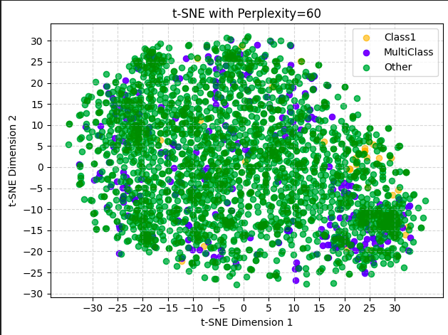
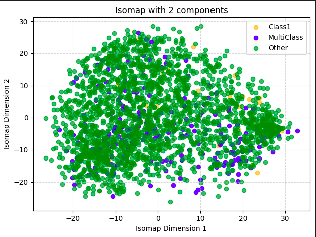

# 📘 Assignment – Visualizing Data Veracity Challenges in Multi-Label Classification

## Name : Krishna Chaitanya
## Roll No :DA25M011

## 📂 Submission Contents
- `submission.ipynb` → The single notebook that contains all code, visualizations, and explanations for this assignment.
- `plots` - This folder containes images of plot sh
## 📌 Overview
This assignment explores the Yeast gene expression dataset to identify data veracity challenges inherent in multi-label classification by applying non-linear dimensionality reduction techniques such as **t-SNE** and **Isomap** to the feature vectors to visually expose these data quality
issues, thereby understanding the challenges a classifier would face.

## Methodology

### Preprocessing the data
 - First downloaded the `yearst.arff` from **MULAN** library and loaded it using `scipy` library inpython
 - Then converted it into a **dataframe** using pandas and created two matrices
   - Feature Matrix X with 103 features
   - Labels Matrix Y with 14 labels
 - Then checked if any null values exist there are no null values.
 - **Standardised** the features as we are applying distance based dimensionality reduction

### T-SNE
- After the preprocessing has been done, we need to apply t-SNE on the scale dataset but to choose the best perplexity value ,we tried applying t-SNE on the dataset with various perplexity values and concluded that **60** is the best value
- And then identified regions in t-SNE such as **Noisy/Ambiguous Labels** , **Outliers** and **Hard to learn samples** visually form the plot.
- Final shape of data after reduction is (no_of_datapoints,2)
- Here is t-SNE plot with perplexity = 60
   

### Isomap
- Similarly applied the Isomap technique on the dataset and reduced its shape to **(no_of_datapoints,2)**
- - Here is the Isomap plot 
   

### Comparison and Curvature

#### 3.1 Comparison of Isomap and t-SNE visualisation
- We can see both **t-SNE** and **Isomap** plots. In the t-SNE plots, we can observe that it forms distinct, dense clusters, but the overall shape is uneven, with small cluster regions.

- This is because t-SNE focuses on local neighbourhood preservation. So it tries to hold similar points tightly, that's the reason we observe small cluster regions in the plot, but the overall shape isn't preserved 

- But if we observe Isomap plots, the plots show more spread out and continuous points because its primary goal is to preserve geodesic distance  (the shortest distance between points along the underlying manifold of the data)

- By preserving this large-scale distance, Isomap effectively unfolds the data, providing a much clearer view of its global structure 

- Therefore, **Isomap** is better at revealing the global structure of the data.

#### 3.2 Data Manifold And its Curvature
- The data manifold concept assumes that high-dimensional data actually lie on a lower-dimensional manifold that is twisted and folded in the high-dimensional space.

- The points in Isomap are not showing linearly separable data.  Instead, the points are spread in a non-uniform way with no clear separation between the groups

- There isn't a simple straight line or a plane that would separate this data.

- This strongly suggests the underlying data manifold is complex, nonlinear, curved, and high-dimensional.

##### 3.2.1 Manifold complexity vs classification difficulty
- If the data lies on an imple manifold where classes occupy different regions. Then it's easy to classify them using just linear models

- But if the manifold is highly curved, then classes may overlap or their boundaries may be very nonlinear, making it harder for the classifiers to separate them.So we need more complex models to separate them.

- In summary, if the manifold is simple, linear classifiers are sufficient for the classification. If they are highly curved or complex, we need more advanced models for the classification

### Conclusion
We can conclude that **t-SNE** is better in preserving local structure and **Isomap** is better in preserving global structure. The more simple the manifold the more easy to classify  
